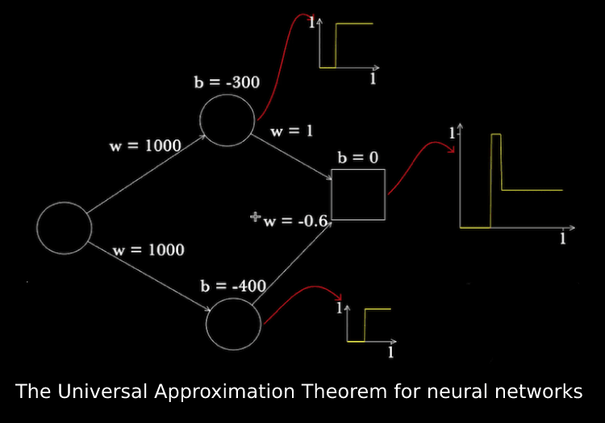
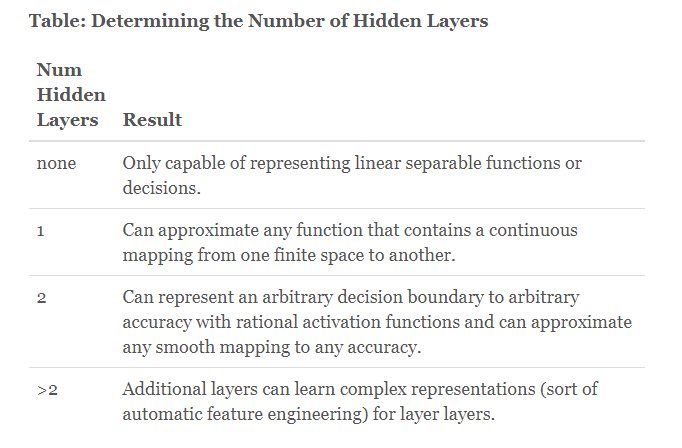
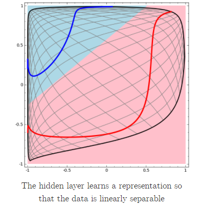
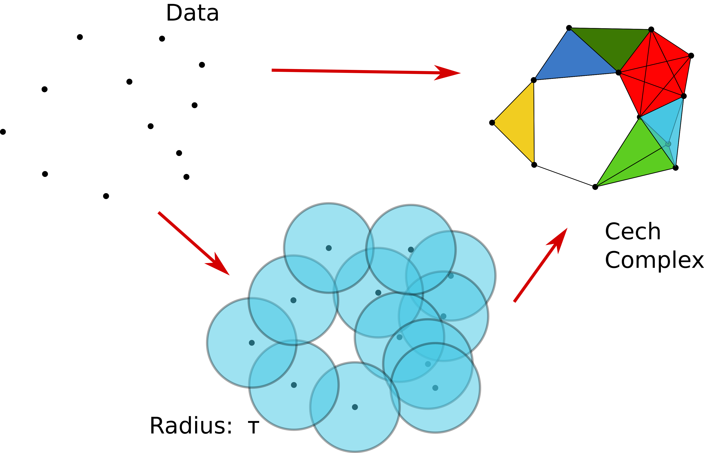

<!-- Why Resnets Work:
https://www.youtube.com/watch?v=RYth6EbBUqM&ab_channel=Deeplearning.ai
https://www.youtube.com/watch?v=ZILIbUvp5lk&ab_channel=Deeplearning.ai

Universal Approximation Theory:
https://en.wikipedia.org/wiki/Universal_approximation_theorem
https://www.youtube.com/watch?v=lkha188L4Gs&ab_channel=CarnegieMellonUniversityDeepLearning

Topology
https://towardsdatascience.com/a-visual-introduction-to-neural-networks-68586b0b733b
https://en.wikipedia.org/wiki/Topological_data_analysis
https://colah.github.io/posts/2014-03-NN-Manifolds-Topology/
https://en.wikipedia.org/wiki/Affine_transformation
Affine transformations on a 2D surface can be done with a LINEAR transformation in 3D!
 => so must be serperated with n+1 dimensions (nuerons)

the NN finding the classficiation boundary is equivalent to a softmax or sigmoid

when the NN failed to classify: "It is worth explicitly noting here that these tasks are only somewhat challenging because we are using low-dimensional neural networks. If we were using wider networks, all this would be quite easy."

Why convolutions?
https://www.youtube.com/watch?v=ay3zYUeuyhU&list=PLkDaE6sCZn6Gl29AoE31iwdVwSG-KnDzF&index=11&ab_channel=Deeplearning.ai
computationally much less in terms of # of params
translation invariance
parameter sharing
sparsity of connections -->

# Introduction
In this report, I wanted to look into the theory of designing a nueral network. This came in part due to me wondering if there was a deterministic way to model you problem. Personally, this is an area that I am interested in, whether it is building algorithms, efficiently determining when you need more data or when you need a change in models, etc. It has always intrigued me why a good amount of answers out there for creating an optimal nueral network is **just experiment and do a grid search.** For that reason, this report is the first step in understanding the motiviation behind neural network design and algorithms.

## Universal Approximation Theory
Starting at the basis of why Artificial Neuron Networks work, we can begin with a single perceptron. That is, the decision boundary is linear. Wondering how you can make your network more complicated, I came across the [Universal Approximation Theory](https://en.wikipedia.org/wiki/Universal_approximation_theorem). What this theory tells us is that you can *abritrary approximate any continuous function with a single hidden layer*. Note, that if you do not have a hidden layer, then it is just a linear combination of your weights onto your output. Let us look at why this theory works.

### Network Width
Network width is typically defined to be the number of neurons you have in a given layer. This is independent from the number of layers in have in your model, the depth. Obviously, you need to have initially match the dimensions so that matrix multiplication works, meaning you first intermediate layer will have a dimension the same as the number of inputs and the final layer will match the number of output classes (or one if it is a regression problem). So let us dive in.

	

Seen in the image above, you see you have two neurons. If you increase the *weight* of these individual nerons, they resemble a steep curve until they model the step function. But say, you want to just model a spike, similar to a delta-dirac function. How would you do that?
Well, given two step functions, you can sum these two values together to obtain an even higher step function. However, if you offset one of the nuerons on the x-axis by altering the value of *bias* and subtract it from the other, you can create a tower-like curve, the spike. In summary, the theory works as such:

* Given two neurons, you can create an arbitrary thin tower
* Making multiple of these "towers" and you can approximate any continuous function
* Extend this to n-dimensions to create cylinders (3d) and beyond

So given you have sufficent capacity in your network (i.e. the number of neurons in a single layer), why would you ever go deeper? If you can approximate *any* function with only one layer, why make it more complicated? That is, why add any more layers?

### Network Depth
An intial look onto the web gets your this [answer](https://www.heatonresearch.com/2017/06/01/hidden-layers.html#:~:text=Traditionally%2C%20neural%20networks%20only%20had,%3A%20hidden%2C%20input%20and%20output.), where it explains that no hidden layers is a linearly seperable problem, 1 hidden layer is a continuous mapping, and 2 hidden layers are for any decision boundary.

	

However, I wanted more of a reason why to increase depth than just "it gets better." This is where YouTube came in handy for me. To answer the first question, I watched an hour long [lecture](https://www.youtube.com/watch?v=lkha188L4Gs&ab_channel=CarnegieMellonUniversityDeepLearning). In this lecture, he covered the same example above but included how depth, decision boundary, and boolean functions relate.

For instance, for a **boolean function**, one layer is enough to do an `AND` gate or an `OR` gate. That is, the gate when it is applied on your inputs. However, there is no way to define your weights and biases to obtain an `XOR` gate. For this, you must add another layer that allows you to construct an `XOR` from an `AND` and an `OR` gate. 

Regarding your decision boundary for classification (which we will get to later), since a single perceptron is just a linear line, you should increase the number of neurons to increase complexity. For example, if you were trying to recreate the shape of a triangle, you can use three neurons. In this case all three will fire if the value is within the shape of the triangle. For a circle, you can add an arbitary amount of neurons. However, what happens when the circle and triangle lie next to each other?

In this case, it would be the summation of the neurons where some would create the circle and some would do the triangle. However, the network does not know these are disjoint shapes in the sample space. Thus, adding an additional layer with, say, two neurons (one each for the cirlce and triangle), allow the complexity of the second layer to be tightly bounded by learning **higher level features**.

In the lecture, it was made clear that a naive one-hidden-layer would require **infinte hidden neurons** for a checkerboard pattern decision boundary. However, when you add an additional hidden layer, then you can decompose the checkboard pattern into all combinations of shapes (16) and number of regions (40). And so you have 16 hidden nuerons for the first layer and 40 for the second.

## Topology of Nueral Networks

In the previous section, we briefly talked about the decision boundary. In this section, we will go over how the sample space is transformed by an Artifical Neural Network to make the data linearly seperable. I came across a very nice [github page](https://colah.github.io/posts/2014-03-NN-Manifolds-Topology/) where it explained the theory of how the decision boundary was accomplished given the number of nuerons as well as the number of layers.

	

### Transformations in Theory

Here it showed that while **the number of neurons created more complex curves that added to the decision boundary complexity, the number of layers allowed for more transformations that were able to distort the space** to make the curves linearly seperable.

This makes sense as each layer has a matrix multiplication operation on it that transforms the data and its space. Along with this, if the activation function is purely linear, then the linear operator outputs a linear boundary decision which is not helpful. Thus, we need to add a nonlinearity for the boundary decision to take more complex paths. Also note that linear transformations via matrices are not the same as **affine transformations**, which include translation. 

In addition to this, I noticed that affine transformations do not perserve the angles such as conformal mappings. This made me wonder(which will be covered in future reports):

* Do angle perserving mappings add any benefit in Nueral Network weighting?
* Do you care about preserving topological properties (introduced in next section)?
* Can you apply other weighting techniques to help navigate the high dimensional surface?

### Transformations Applied to ANN's

Building off of point #2, in order to preserve topological properties, we must operate with **homeomorphisms**. As the github page puts it, it is a bijection between two continuous functions. 

For our weight matrices, if the determinant is non-zero, it is invertible and unique. Secondly, a linear transformations such as the bias are also homeomorphisms. Lastly, activation functions such as tanh are bijective for certain values in the domain (not too small or large I presume). However, ReLu is not, which is similar to tanh if you are below a certain threshold, which means you can not apply an inverse ReLu to return to your domain.

In the article, it gives an example that relates back to our Universal Approximation Theorem: you need (N+1) Nuerons to seperate your N-dimensional space. Think about it this way, if you had a 2D circle, you would need three neurons (3D) to transform the 2D circle linearly.  Thus, if you had an enclosed circle, projecting it into 3 dimensions, such as a SVM, you can seperate the two surfaces with a hyperplane in 2D via your shift in 3D. 

## Misc Research during the Report

In an effort to learn more about this, I would want to look into topology. While I was researching this, I learned that there exists a field called **topological data analysis**, which contains the technique called **persistent homology**. It appears this is more for data exploration or clustering algorithms as it uses simplical complexes to connect data points in high dimensions. It then performs persistent homology and somehow gets out a better picture of the data.

	

I have started watching lectures about this topic to learn if I can take any information from it, but this will have to be covered in a future report. In addition to topology, I would want to look into the general design of networks (such as learning theory, architecture building, optimization methods, etc.)

I have also started to get PyTorch running. In a future report, I would like to go deep into PyTorch so that I can implement and debug any model I choose (or at least have a foundation). This would allow me to mess around with different algorithms and see if I can improve them by changing functions, geomtry, etc. It is far more easier to do this in PyTorch than in Tensorflow, I have read.

Lastly, I also took the time to watch some videos about [ResNet](https://www.youtube.com/watch?v=RYth6EbBUqM&ab_channel=Deeplearning.ai) and [CNN's](https://www.youtube.com/watch?v=ay3zYUeuyhU&list=PLkDaE6sCZn6Gl29AoE31iwdVwSG-KnDzF&index=11&ab_channel=Deeplearning.ai), as during this report I wondered why devite from MLP's if they can approximate any function. The answer I got for CNN's were that they

* Require many less paramters than a MLP for the same task
* Are able to share parameters through convolutions and are invariant to translations
* Have sparsity of connections at a given time, allowing them to be more efficient

For ResNet, the answer I got was what you mentioned in class: it maintains the geomtry of one layer if the next layer is useless (in this sense it would skip over). This allows you to append many number of layers and not worry about it being forced through transformations, causing overfitting.
