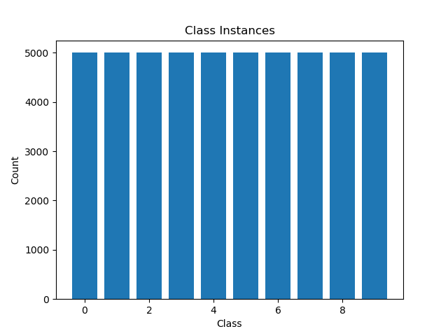
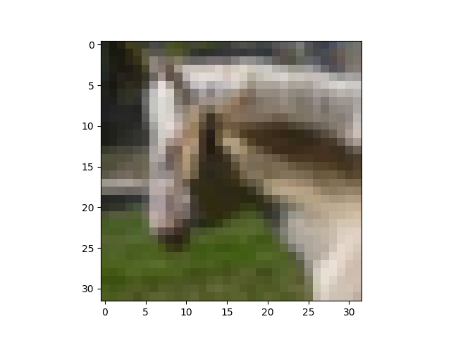
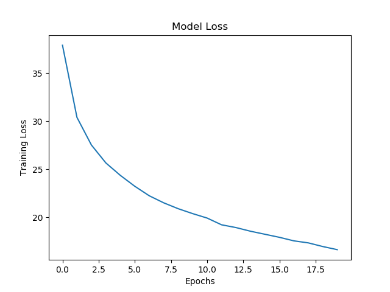

# Introductory PyTorch with CIFAR10
## Introduction
In this report, I learned the basics of **PyTorch** and supplemented it with different tasks. For instance, I built a CNN with CIFAR10 data to use as a baseline against future models.

I also did some data exploration on **CIFAR10** to learn more about the data that I was working with. I would want to do more data exploration in a new report, covering various techniques. I also used the `nn.Sequential()` module for everyhting here, but looked into more complicated features of PyTorch such as hooks and the **Functional** module. This I will cover in the future.

*Note: In this report, I used so many different sources to learn that I can not pin down which part is from where. However, I will say [Python Engineer]() on YouTube was a tremendous help. I watched at least of his videos (CNN, Autograd, DataLoader, Backpropagation, etc.). I also used these github pages [(1)](https://github.com/yunjey/pytorch-tutorial/blob/master/tutorials/02-intermediate/convolutional_neural_network/main.py) [(2)](https://zhenye-na.github.io/2018/09/28/pytorch-cnn-cifar10.html) for my first CNN model in PyTorch. Lastly, there are some more resources that I listed in the top of my code if you want to check it out. This excludes random troubleshooting that I found on StackOverflow. I apologize for the layout of the sources; however, since I was jumping back and forth to learn PyTorch, I figured it would be best to have a blanket cover of sources.*

## Guide to CNN Model with CIFAR 10 Data
The main appeal towards PyTorch is its flexibility and its use of tensors. Tensors, instead of arrays, are able to run on the GPU which drammatically increase computational speed. 

It also has an "out of the way" approach where programming feels like programming rather than high level terminology. Thus, it has the ability to be very powerful for researchers who like to change small parts of their model for mathematical reasons.

This was the main reason why I chose this. I understand that **TensorFlow** is widely used in the industry, but I felt that I have always wanted total control over my network, and I get the feeling with PyTorch.

### Data Exploration
PyTorch is nice in the fact that it has many datasets that you can call via the API or download directly on your computer. Since I chose CIFAR10, and knowing that it is used quite a lot in papers, I decided to download it as well. This was done with the following code:

```python
bs = 25
# defining the transform as 1) converting it from X to tensor and 2) normalizing it to [-1,-1].
transform = transforms.Compose([transforms.ToTensor(), transforms.Normalize((0.5, 0.5, 0.5), (0.5, 0.5, 0.5))])

# Importing CIFAR10 and creating batches
trainset = torchvision.datasets.CIFAR10("/projects/brfi3983/", train=True, download=True, transform=transform)
testset = torchvision.datasets.CIFAR10("/projects/brfi3983/", train=False, download=True, transform=transform)
train = DataLoader(dataset=trainset, batch_size=bs,shuffle=True, num_workers=2)
test = DataLoader(dataset=testset, batch_size=bs, shuffle=False, num_workers=2)
```

In the above code block, we used torchvision (which holds the datasets) to download the code to `</projects/brfi3983/>`. Since we want to train the model and then test it on unforseen data, we can set `train=True` for training and `train=False` for testing. 

Notice that we have to convert the data to a tensor (since PyTorch works with tensors) and then normalize it. Normalizing it is done to each channel so that the range of the pixel values are all the same. This also leads to faster convergence for the nueral network due to the smaller magnitudes and a smoother gradient with less zig-zagging.

In the last two blocks of code, you will notice we use `DataLoader`, this is because we want to take our large number of samples and split it up into batches. These are then fed into our network one at a time. If we increase our batch size, it decreaes complexity and improves generalization. It also increases training speed. You would not want to do this if you are underfitting (although there are many ways to counter).

Next, we want to explore the CIFAR10 data before passing it through out model. First, we will just check the size of the dataset

```python
print(f'\nTraining Set Shape:{trainset.data.shape}') # (50000, 32, 32, 3)
print(f'Test Set Shape:{testset.data.shape}') # (10000, 32, 32, 3)
print(np.array(trainset.targets).shape) # (50000,)
print(np.array(testset.targets).shape) # (10000,)
```

Notice that for trainset, **(50000, 32, 32, 3)** corresponds to **(samples, width, heighth, channels)**. So in short, we have fairly low resolution images with 3 channels that coreespond to RGB and 50,000 training samples. This is the same for testset but we have 10,000 samples to test our accuracy.

Generally speaking, it is good to have as much data as possible for deep learning if the task requiers it. Since we can get a pretty good score on this dataset out of the gate, it is less of a concern. However, you can make your training set make up more samples if you need that additional data. This is where data augmentaiont also comes into play.

Now we will do some more data exploration with the dataset we have. Since unbalanced datasets are a problem, we must make sure our dataset is not unbalanced. We can do this by checking the number of instances of each class.

```python
print(f'Classes: {trainset.classes}')
print(f'Length of Classes: {len(trainset.classes)}')
instances = dict(Counter(trainset.targets))
print(f'Instances of each class: {instances}')
print(trainset.class_to_idx)
```

Output:

```bash
Classes: ['airplane', 'automobile', 'bird', 'cat', 'deer', 'dog', 'frog', 'horse', 'ship', 'truck']
Length of Classes: 10
Instances of each class: {6: 5000, 9: 5000, 4: 5000, 1: 5000, 2: 5000, 7: 5000, 8: 5000, 3: 5000, 5: 5000, 0: 500
5000}
{'airplane': 0, 'automobile': 1, 'bird': 2, 'cat': 3, 'deer': 4, 'dog': 5, 'frog': 6, 'horse': 7, 'ship': 8, 'truck': 9}
```

This code takes the trainset and prints out the classes, the number of classes, and the instances using a module. The instances are stored into a dictionary with their label as the key and the number of instances as the values. We can see the class each key corresponds to using the last line. Here is the histogram of the results:

<p align="center">
	
</p>

Yay, our data is balanced! This will make our process much easier. Now to inspect our data further, we can acutally take a look at what one of the images looks like. This done with `matplotlib.pyplot`:

```python
# Sample Image and label
random_int = np.random.randint(0, 50000)
image, label = trainset[random_int]
image = image / 2 + 0.5 # This is to undo our normalizing
print(f'Input Image Shape: {image.shape}\n')

# Showing Sample Image
image_t = image.permute(1, 2, 0)
print(f'This is a {trainset.classes[label]}!')
plt.imshow(image_t)
plt.show()
```

Above, we first grab a random index in the trainset, grab that sample and store them into an image and label, where the size is **(3, 32, 32)**. We then unnormalize our image. Since its shape is **(3, 32, 32)** but `matplotlib.pylot`'s imshow() function takes the input as **(width, heighth, channel)**, we swap the axis with the `.permute` method. Then we get the following

<p align="center">
	
</p>

This is a horse! Above, you will notice that the image is quite blurry and low resolution. In all honesty, it is hard for a human (at least me) to classify the image. This is what impressed me when I ran the model - its accuracy. I can only image what it can do with higher resolution images. In the future, maybe I will use a pretrained model and its weights to do transfer learning on this dataset. I belive that would be interesting.

### Creating our Model
First, we need to talk about how PyTorch creates its model and uses its methods and attributes. To make a model, we create a class of the form

```python
class CNN(nn.Module):
	def __init__(self, num_classes):
		super().__init__() # This inherents nn.Module
		# Creating layers and attributes for the model

	def forward(self, x):
		# Passing the data through the model
		return x
```

There are two main parts in the model: `def __init__(self, num_classes)` and `def forward(self, x)`. The first part holds the layers and any information you want to store. The second will act as the forward pass in our model, where the data flows through the architecture. Also notice that we use `super().__init__()` to inherit `nn.Module`.

Although I did not cover it to much detail here, there are various reasons why you would intialize a `ReLU()` layer rather than using the Functional module `F.relu()`. This has to do with retrieving gradients and weights or modifying your structure. In the future, I will look into this so I feel I have more control over the network.

Now that we know the basic structure, we can add our layers in `__init__()` with the `nn.Sequential()` module. Since we are trying to classify images, we can implement a **Convolutional Neural Network (CNN)**. Without going into details, we used dropout and batch normalization in our model. The defined class and architecture is defined below

```python
class CNN(nn.Module):
	def __init__(self, num_classes): # init object
		super().__init__() # inherent nn.Module methods
		self.block1 = nn.Sequential(
			nn.Conv2d(in_channels=3, out_channels=64, kernel_size=5, stride=1),
			nn.BatchNorm2d(64),
			nn.ReLU(),
			nn.MaxPool2d(kernel_size=2, stride=2))
		self.block2 = nn.Sequential(
			nn.Conv2d(in_channels=64, out_channels=32, kernel_size=5, stride=1),
			nn.BatchNorm2d(32),
			nn.ReLU(),
			nn.MaxPool2d(kernel_size=2, stride=2))
		self.fc_layers = nn.Sequential(
			nn.Linear(32*5*5, 64),
			nn.ReLU(),
			nn.Dropout(p = 0.2),
			nn.Linear(64, 32),
			nn.ReLU(),
			nn.Dropout(p = 0.2),
			nn.Linear(32, num_classes))

	def forward(self, x):
		# Convolution Layers
		x = self.block1(x)
		x = self.block2(x)

		# Fully Connected Layers after flattening
		x = x.view(x.size(0), -1)
		x = self.fc_layers(x)

		return x
```

The main things to note are that we have two blocks are convolutions and then we have fully connected layers. Notice that the input channels in the first block are 3 channels (RGB). Apart from flattening our layers to be fully connected, the number of nodes are fairly abtritrary that lend to depend on the complexity of the problem. In `forward()`, you can see that we first go through block1, block2, and then the fully connceted layers. Now we can create an object of this class and start our model.

First we search for a dedicated GPU on our computer. If one exists, we can then send our data to the device along with the model - this will speed up our computation. Obviously there are other ways to do this if you have multiple GPU's or if you are using a research computing node; however, we will only cover a local dedicated GPU in this report. This check is done by

```python
if torch.cuda.is_available():
	device = torch.device("cuda:0") # setting new device
	print("GPU activated.")
else:
	device = torch.device("cpu")
	print("CPU activated.")
```

Next, we create our model, send it to the GPU, set our loss **CrossEntropyLoss** and optimizaton. This is done by

```python
model = model.to(device)
print('=> Model Created')
print(model) # Model Architecture
criterion = nn.CrossEntropyLoss() # Already takes into account logits and softmax
optimizer = torch.optim.Adam(model.parameters(), lr=learning_rate)
```

Above, you will see that we called `print(model)`, this gives the overall architecture of the model seen below:

```bash
=> Model Created
CNN(
(block1): Sequential(
	(0): Conv2d(3, 64, kernel_size=(5, 5), stride=(1, 1))
	(1): BatchNorm2d(64, eps=1e-05, momentum=0.1, affine=True, track_running_stats=True)
	(2): ReLU()
	(3): MaxPool2d(kernel_size=2, stride=2, padding=0, dilation=1, ceil_mode=False)
)
(block2): Sequential(
	(0): Conv2d(64, 32, kernel_size=(5, 5), stride=(1, 1))
	(1): BatchNorm2d(32, eps=1e-05, momentum=0.1, affine=True, track_running_stats=True)
	(2): ReLU()
	(3): MaxPool2d(kernel_size=2, stride=2, padding=0, dilation=1, ceil_mode=False)
)
(fc_layers): Sequential(
	(0): Linear(in_features=800, out_features=64, bias=True)
	(1): ReLU()
	(2): Dropout(p=0.2, inplace=False)
	(3): Linear(in_features=64, out_features=32, bias=True)
	(4): ReLU()
	(5): Dropout(p=0.2, inplace=False)
	(6): Linear(in_features=32, out_features=10, bias=True)
)
)
```

### Training our Model
To train our model, we simply take a batch at a time, pass it through our model, calculate the loss, and then backpropagate. Obviously, this is the simplifed version but more will be explained later. 

```python
# Training
model.train()
print('=> Training Started')
for epoch in range(epochs):
	for i, data in enumerate(train):
		# Grabbing batch
		X_train, y_train = data

		# Sending data to gpu device for training
		X_train, y_train = X_train.to(device), y_train.to(device)

		# Passing Data through Model and Calculating Loss
		y_pred = model(X_train)
		loss = criterion(y_pred, y_train)

		# Backward pass and updating weights
		optimizer.zero_grad() # need to zero so weights do not accumulate
		loss.backward() # total gradients

print('=> Training Finished')
```

Above is the minimum amount you need to write to get the job done. In the final version, I kept track of the running loss so that I could plot the training loss per epoch during the process. In the future, I would like to include a validation set so that I can track both the training and validation curve to further speed up my hyperparamter tuning. This way, I can make sure that I generalize well without underfitting. Below is an example of what you can expect from a form of the above code snippet.

Output
```bash
Epoch [20/20], Step [1000/2000], Loss: 0.4556
Epoch [20/20], Step [1100/2000], Loss: 0.7141
Epoch [20/20], Step [1200/2000], Loss: 0.6924
Epoch [20/20], Step [1300/2000], Loss: 0.5411
Epoch [20/20], Step [1400/2000], Loss: 0.4372
Epoch [20/20], Step [1500/2000], Loss: 1.0928
Epoch [20/20], Step [1600/2000], Loss: 0.6178
Epoch [20/20], Step [1700/2000], Loss: 0.5219
Epoch [20/20], Step [1800/2000], Loss: 0.7682
Epoch [20/20], Step [1900/2000], Loss: 0.6462
Epoch [20/20], Step [2000/2000], Loss: 0.9181
=> Training Finished
```

### Testing our Model
Here is the output for the training loss as well (not shown in above code):

<p align="center">
	
</p>

To test our model, we must make sure we are first in `model.eval()` mode. This freezes dropout and batch normalization so that when we evaluate our model, they do not change. 

In additon to this, we must make sure any computations we do with our tensors are not stored in the autograd system. Specifcally, when we take our input `X` and do a tensor operation, say `Y = X*2`, if `requires_grad = True`, then it will keep track of the gradients so that when we do our backward pass, it will be able to calculate the local partials before doing the chain rule. Since we already trained our network and have our weights, we do *not* want to update our gradients. Thus we wrap our code in `with torch.no_grad():`.

However, the concept of testing is the same as training. We take our data, pass it through the model, and then instead of calculating our loss and backpropagating, we simply compare our predicted values to the true values and evaluate our accuracy. Doing this we can write

```python
# Testing
model.eval() #used to freeze batch norm and dropout (does not do anything for gradients!)
print('=> Testing Started')

# Using torch.no_grad() to not store tensor operations
with torch.no_grad():
	correct = 0
	total = 0
	for i, data in enumerate(test):

		# Mini batch again
		X_test, y_test = data

		# Sending data to gpu device for testing
		X_test, y_test = X_test.to(device), y_test.to(device)

		# Passing though data and calculating accuracy
		y_pred = model(X_test)
		_, predicted = torch.max(y_pred.data, 1)
		total += y_test.size(0)
		correct += (predicted == y_test).sum().item()

	# Stats
	print('=> Testing Ended')
	print('Test Accuracy of the model on the 10000 test images: {} %'.format(
		100 * correct / total))

```

Although the parameteres in the code might be slightly different, you should end up with an output similar to the one below.

```bash
=> Testing Started
=> Testing Ended
Test Accuracy of the model on the 10000 test images: 73.58 %
```

### Model Analysis
In this last section, I wanted to go more deep into model analysis for troubleshooting purpose. This would also give more greater control in case I wanted to add a custom function, modify the gradients, or inspect the size of my layers. Thus, I started looking into hooks, getting weights, and the Functional module. 

I watched this [video](https://www.youtube.com/watch?v=syLFCVYua6Q&ab_channel=ElliotWaite), which went over in depth how hooks work. In a summary, he covered basic operations such as tensor multiplications but then showed a computational graph with the nodes. This allowed me to see not only autograd but also when you register hooks. 

In short, there are `forward` hooks and `backward` hooks. We can pass `lambda` functions to print out or modify our graidents that are retrived by `Tensor.retain_grad()`. This gives you control over modifying your gradients *as they pass through* your network. For instance, this would be useful if your gradients are exploading or vanishing and you are unsure which part of the model it is happening.

While I did not implment any hooks this time around (I want to cover a more in depth model analysis/debugging article), I did try to get the weights from my model. *Note: I belive the weights I obtained were the trained weights, but I would want to get the pre-trained weights as well (or just weights at any time - hooks!)*. Doing this, I used my archecture to go through the model and its modules and then index the `nn.Sequential()` layer. This was done by

```python
# Grabbing a weight for a layer
relu1_w = model.block1[0].weight.cpu().detach()
print(f'Sample weight access after training:\n{relu1_w.numpy()[0,0,:,:]}')
```
Output:
```bash
Sample weight access after training:
[[ 0.0857374   0.01333369 -0.1746179  -0.02721789  0.08426241]
 [-0.24448405 -0.33294487  0.20572886  0.24578817 -0.00774883]
 [-0.2280566   0.3630049   0.41283107  0.06304478 -0.25628254]
 [ 0.22428633  0.1062545  -0.48363245 -0.10447272  0.06123958]
 [-0.01139794 -0.18545358 -0.08785076  0.16182114  0.0629783 ]]
```
I noticed that `model.block[0].weight` did not work, so I added `.cpu()` which makes sense since I sent it to my GPU. However that did not work, so I did `.detach()` which I belive strips it from `requires_grad=True`. I was then able to convert it to an ndarray with `.numpy()`. If we want to do the opposite(numpy -> Tensor), we can do `.from_numpy()`.

### Future Plans
In the future, I plan to go more in depth with model analysis and hardware functionality. I hope to learn exactly how to control your neural network and make any changes necessary at any time. This would be incredibly useful as a researcher. I also will extend this to my first report about using multiple GPU's with the `Lightning` wrapper. This then can be passed to a GPU cluster and have the output done in a very short amount of time (non-interactively). 

I also want to have a healthy amount of a report relating to *just the data*. I have been trying to learn PyTorch so that I can do future projects on it in the class, but as someone who is interested in data science, I would love to have a comprehensive report on analysing the data (sparsity, linear correlation, distribution of channels, frequency if time series, etc.). Specifically, it would be nice to know how to efficiently build a model based off the data (such as when to know you can just do a traditional method vs. deep learning). The goal would be to have the intution to setup the problem mostly correct and then finetune later. I plan to ask about that soon!

Lastly, there are some random things that I would like to touch up on such as getting a validation accuracy and curve, using tensorboard, and learning the difference between `__init__()` and `nn.Functional` . I also would want to do this again but with less structured data so that I have the experient of a custom dataloader, converting to tensors, etc.