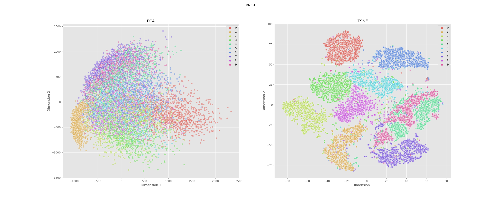
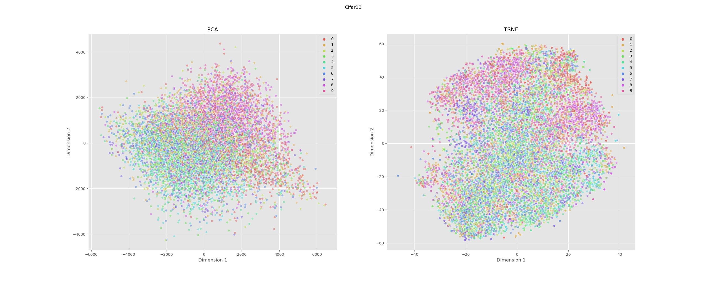
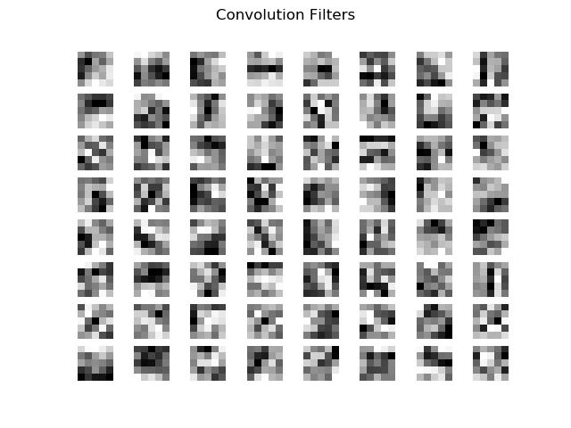
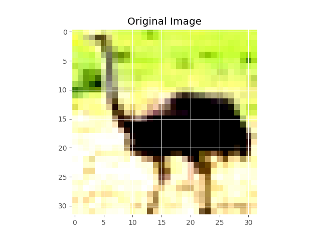
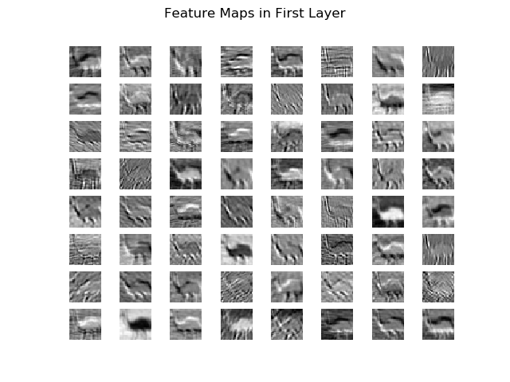
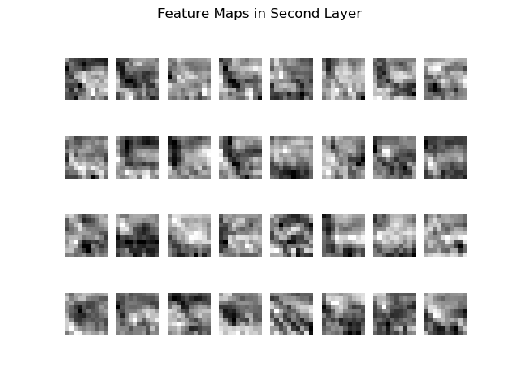
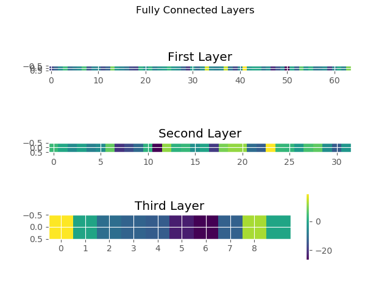
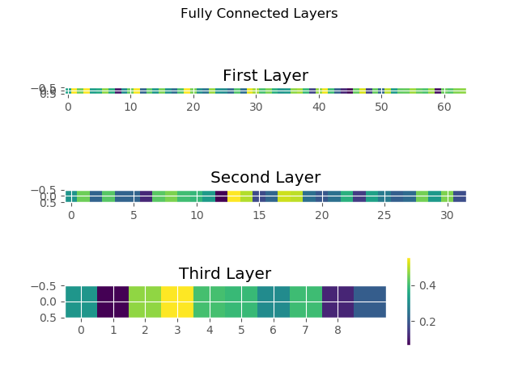

<!-- https://www.youtube.com/watch?v=0ZQxPIwuA4o&ab_channel=NPTEL-NOCIITM -->
# Introduction
In this report, I focus on visualizing a neural network as well as the input data. Most of this was done with a pre-trained **Convolutional Neural Network (CNN)** that I computed in a previous project on a SLURM cluster. In that example, we achieved around 85% test accuracy with 100 epochs. This allows us to visualize layers in the model for specific CIFAR10 images and their corresponding activations.
# Original Data
Before we continue onto training on our data, it is generally a good idea to do some data exploration. In a previous report, I did some elementary exploration such as visualizing the images, plotting the distribution of the instances per class, and exploring the structure of the dataset as well as the individual images. In this report, we will be utilizing dimensionality reduction techniques to estimate the complexity of our data, specifically PCA and t-SNE.
## PCA and t-SNE
PCA, otherwise known as **Principal Component Analysis** is a *linear* dimensionality reduction technique. It works by finding correlations within the data and combining them to reduce a dimension. It is best at preserving global structure as it tries to maintain pairwise distances. We can do this for a simple dataset, MNIST, and a more complex dataset, CIFAR10. PCA is one of the most common techniques to reduce dimensionality as there is usually linear dependencies.

t-SNE, known as **t-distributed stochastic neighbor embedding**, is a *nonlinear* dimensionality reduction technique that aims to reflect local distances between points when the data is projected into a lower dimension. Thus, its global structure is different while its local structure is not. These can be adjusted with hyperparameters.

Lastly, we have a more recent dimensionality reduction called UMAP, **Uniform Manifold Approximation and Projection**, a *nonlinear* dimensionality reduction technique. Although I did not get to try this out until it was too late. It is important to note that UMAP makes the best of the above 2 methods. Firstly, it preserves local and global structure through the use of simplical complexes (see report 5) and secondly, it is much more efficient algorithm with larger datasets. I hope to experiment with this in the future.

I computed both PCA and t-SNE for the first 10,000 samples on the MNIST set as well as CIFAR10.

Here we can see MNIST:



Notice that although the PCA plot looks like it captured some patterns, the t-SNE plot was much better and actually helped to separate the data. This suggest that the data can be disentangled fairly easily and does not require too deep (or wide) of a network - although it does show that nonlinearity might be needed. This can then help one implement only a necessary algorithm with sufficient accuracy and speed (such as a multilayer perception vs. ResNet).

Simarly, we can apply the same technique, with the same number of samples and dimensions to a more complex dataset, such as CIFAR10.



Here you can see quite a difference as both PCA and t-SNE seem to not work too well. This shines light that the dataset might need a more complex model to help separate the different classes. Recall that these are from the *original* data. If we pass this through a network that stretches, folds, and changes the topology (see report 5), we can then apply these visualization techniques again and it should be easier to separate the data.

*I intended to do this ImageNet as well; however, I lacked the storage capacity and could not get it to work without having to downloading it (depreciated in a recent update - requires external download)*
### Autoencoders and Dimensionality Reduction
Now, although it seems like an easy question to ask regarding this plot is "Why can't I do a clustering algorithm on the output from t-SNE?". The reason this can not be done is that there are no learnable parameters that allow one to take an arbitrary example and classify it. There is simply no way to backtrack our plot to any new sample. However, you can take the output to be the input to a model - but there exists some randomness depending on the algorithm (t-SNE is stochastic while PCA is not).

However, there are ways to emulate this decomposition (both PCA and t-SNE) by using an autoencoder, where the bottleneck layer is the number of reduced dimensions (2 in the case above). By altering the loss function as well as the structure, one can simulate the techniques above and use them for any new sample. For instance, if you want to [simulate PCA](https://www.youtube.com/watch?v=PSOt7u8u23w&ab_channel=ArtificialIntelligence-AllinOne), you need to have linear layers and a loss function of mean squared error (MSE).

t-SNE is a bit tricker as the backpropagation and reconstruction error from the autoencoders preserve global structure. It seems like there are papers our there attempting to relate the two. However, I came across a comment that mentioned that you can use an autoencoder to reduce the dimensionality of your dataset to a lower, but not final, dimension and then use t-SNE to visualize it. This would help combat the differences and combine efforts into a final visualization.
# Intermediate Layers in CNN
To access intermediate layers in a neural network, I utilized a previous technique that I glossed over called **hooks**. These can be registered for a forward or backward pass. This allows you to grab parts of your network, such as the output of a `nn.Relu()` layer when you can not call `.weight()` on your model. It can also allow you to alter the gradients on the backward pass. Ultimately, it gives you more control. Here, we utilize them to grab the output layers for our convolutional layers as well as the fully connected.
We first define a hook function (this could be a lambda function too)
```python
def extract_conv_output(array):
	def hook(model, input, output):
		array['conv'] = output.detach()
	return hook
```
Above, we take the output, which we remove from the graph, and store it into a dictionary with a key of `'conv'`. As you can see, we passed in an array in the parent function `extract_conv_output()`. This allows us to save the contents from our hook rather than just altering or printing them. Thus, we can use this function in the following way:
```python
conv1 = {}
model.block1[0].register_forward_hook(extract_conv_output(conv1))
```
Hooks are meant to be registered on modules or tensors. Thus, for our particular model architecture, which is seen below, we wanted to ultimately grab the output from layer `0` of `block1` in our `model` (an object of the `CNN()` class).
```bash
CNN(
  (accuracy): Accuracy()
  (block1): Sequential(
    (0): Conv2d(3, 64, kernel_size=(5, 5), stride=(1, 1))
    (1): BatchNorm2d(64, eps=1e-05, momentum=0.1, affine=True, track_running_stats=True)
    (2): ReLU()
    (3): MaxPool2d(kernel_size=2, stride=2, padding=0, dilation=1, ceil_mode=False)
  )
  (block2): Sequential(
    (0): Conv2d(64, 32, kernel_size=(5, 5), stride=(1, 1))
    (1): BatchNorm2d(32, eps=1e-05, momentum=0.1, affine=True, track_running_stats=True)
    (2): ReLU()
    (3): MaxPool2d(kernel_size=2, stride=2, padding=0, dilation=1, ceil_mode=False)
  )
  (fc_layers): Sequential(
    (0): Linear(in_features=800, out_features=64, bias=True)
    (1): ReLU()
    (2): Dropout(p=0.2, inplace=False)
    (3): Linear(in_features=64, out_features=32, bias=True)
    (4): ReLU()
    (5): Dropout(p=0.2, inplace=False)
    (6): Linear(in_features=32, out_features=10, bias=True)
  )
)
```
Now, we can do this for all layers. In retrospect, I could have compacted my code quite a bit by just using the `named_modules` attribute on my model and saving the output to a corresponding key in a dictionary (e.g. 'conv', 'fc', 'activation', etc.); however, I was purely focused on trying to get the visualizations to work.
## Filters
Now using the technique above, we can take parts of our neural network and visualize them. This video helped [tremendously](https://www.youtube.com/watch?v=ho6JXE3EbZ8&ab_channel=DigitalSreeni). This is particularly handy for a dataset of images. For the filters of a CNN, we can actually just get the weights of a specific layer by using `.weight`.
```python
conv1_weight = model.block1[0].weight.detach().numpy()
```
Doing so, we can get, for example, the weights of the first convolutional layer. This shape should then be `(64, 3, 5, 5)`. This is because we called for the layer size to have 64 filters, where each filter is 5x5 in area with a depth of 3 channels. Here, we will only plot them in grayscale, that is one channel. We can do this by plotting each filter as a subplot of a figure with an 8x8 grid.
```python
plt.suptitle('Convolution Filters')
for i in range(0, conv1_weight.shape[0]):
	plt.subplot(8, 8, i + 1)
	plt.axis('off')
	plt.imshow(conv1_weight[i,0,:,:], cmap='gray')
```


Unless you know how to read kernels in CNN's, this might not be that interesting. However, instead of visualizing the kernels that are applied to the images being passed through the network, what if we visualized the image as it is passed through the network? That is where feature maps, also called activation maps, come in.
## Feature Maps
It is important to note that visualizing feature maps uses the same process as above. So, with our pre-trained network again, instead of passing in batches of images to our `trainer.fit()` call, we simply freeze our model, take a single image, and pass it through our object of the `CNN()` class, where `.forward()` should be called. First we take our pre-trained network and freeze its parameters.
```python
model = CNN.load_from_checkpoint(checkpoint_path="C:/Users/user/Documents/School/2020-2021/APPM 5720/Report4/checkpoints/epoch=99.ckpt")
model.freeze()
```
Next, we instantiate an object from the `DataModule()` class after downloading and splitting our data.
```python
# Loading in CIFAR10 Data
dm = DataModule(bs, 'cifar10')
dm.prepare_data()
dm.setup()

# Taking an example image
image, label = dm.train_dataset[0]
image = image.unsqueeze(0)
```

This gives us the following image:



Since we want this single image to act as a single batch, we call `.unsqueeze()` on it to change its shape from `(3, 32, 32)` to `(1, 3, 32, 32)`. The methods `.prepare_data()` and `.setup()` as well as how the above code works are explained by the below module structure.
```python
class DataModule(pl.LightningDataModule):
	def __init__(self, bs, data_str):
		super().__init__()

		# Defined constants and transforms
		self.batch_size = bs
		self.data_str = data_str
		self.transform_cifar10 = transforms.Compose([transforms.ToTensor(), transforms.Normalize(mean = [0.4914, 0.4822, 0.4465], std = [0.2023, 0.1994, 0.2010])])
		self.transform_mnist = transforms.Compose([transforms.ToTensor(), transforms.Normalize((0.1307,), (0.3081,))])

	# Downloading the data
	def prepare_data(self):
		if self.data_str == 'cifar10':
			self.full_dataset = torchvision.datasets.CIFAR10("/projects/brfi3983/", train=True, download=True, transform=self.transform_cifar10)
			self.test_dataset = torchvision.datasets.CIFAR10("/projects/brfi3983/", train=False, download=True, transform=self.transform_cifar10)
		if self.data_str == 'mnist':
			self.full_dataset = torchvision.datasets.MNIST("/projects/brfi3983/", train=True, download=False, transform=self.transform_mnist)
			self.test_dataset = torchvision.datasets.MNIST("/projects/brfi3983/", train=False, download=False, transform=self.transform_mnist)
	# Splitting our data for our model
	def setup(self, stage=None):
		if self.data_str == 'mnist':
			self.dims = (1, 28, 28)
			self.train_dataset, self.val_dataset = random_split(self.full_dataset, [55000,5000]) # 60,000 "training" images = 55,000 training and 5,000 validaation
		if self.data_str == 'cifar10':
			self.dims = (1, 3, 32, 32)
			self.train_dataset, self.val_dataset = random_split(self.full_dataset, [45000,5000]) # 50,000 "training" images = 45,000 training and 5,000 validaation
```
Finally, we can take our prepared image and pass it through our network where our hooks will store the output of our convolutional layers. This is separate from the weight (the filters) that we extracted before as now an actual image is being pass through and we can see how the filters are applied after each convolutional layer. First recall our hooks:
```python
# Hook function
def extract_conv_output(array):
	def hook(model, input, output):
		array['conv'] = output.detach()
	return hook

# In main
conv1 = {}
model.block1[0].register_forward_hook(extract_conv_output(conv1))
```
Next, we extract the contents from our dictionary and plot it using the same procedure as the filters:
```python
# Converting from torch tensor to numpy array
conv1_layer = conv1['conv'].cpu().numpy()

# Graphing First Feature Maps Layer
plt.figure()
plt.suptitle('Feature Maps in First Layer')
for i in range(0, conv1_layer.shape[1]):
	plt.subplot(8, 8, i + 1)
	plt.axis('off')
	plt.imshow(conv1_layer[0,i,:,:], cmap='gray')
```
Thus, we get the following figure



Here you can see that some kernels applied a gaussian blur, sharpening, inverting, etc. This is particularly handy if you were wondering how the network learned to distinguish between photos (Did it look at detail? Overall shape? Colors? etc.).

You will also see that as the network goes deeper, it picks up more complicated features. This can be visualized by plotting the feature maps from the second layer rather than the first layer. I will note, however, that in my particular model, my output resolution for the following layer decreased and so it is hard to see the meaning behind the plots.



## Fully Connected Layers
We can also visualize the fully connected layers. These, although, are quite a bit less interesting as they are fairly arbitrary up until the last layer. However, I suspect you can see if you have many dead neurons if you wish to diagnose say a vanishing gradient problem. It could also demonstrate that maybe you can reduce your complexity if only a small portion of them are firing. Nonetheless, I wish to look more into this.

Now, using the exact same hook process defined above, we can see the activations in our network from the fully connected layers. First, we look at an example where the model predicted correctly with high confidence:



Notice that only one column is highlighted yellow and the range of values, depicted from the colorbar, is quite high. This could be useful in diagnosing adversarial problems if a network believes the image is a certain prediction as well as that it is *not* these other images. In other words, it sees the differences as much as the similarities. Below, we have the raw output as well.
```bash
Predicted Label: 0 | True Label: 0
Final Layer's Activations: [[ 16.461245   -7.0971355 -19.870764  -22.187313  -23.881903  -35.873703
  -40.333344  -22.65644     8.960646   -6.9376583]]
```
Next, we look at an example when it was unsure of a prediction and ultimately got it wrong.



As you see, the range was not particularly high and there were quite a few labels that were about equal. You can see the specific values in the printed final fully connected layer below, where a high number is better (and the highest gets picked as the prediction).
```bash
Predicted Label: 3 | True Label: 4
Final Layer's Activations: [[-1.5353802  -3.4757438  -0.39173567  0.22166687 -0.8661632  -0.98690784
  -1.6894689  -0.9254993  -3.094439   -2.383211]]
```
## Future Plans
For the last report, I plan on picking a specific topic that we have covered in class and just trying to explore the idea presented in the paper. I hope to implement it and explore the math as well as confirm why it works.

Ultimately, I hope to put transfer learning to use. I was going to use a pre-trained ResNet model for this visualization paper; however, I used it completely bare without any training and did not realize it until I got my checkpoint to work from my previously trained CNN.

Another note is that this next report will generally be along the lines of what I would like to do for the final project. Thus, I can pool my skills, along with others if I have a group, and help build a meaningful project as I might have some general ideas or experience from a report.