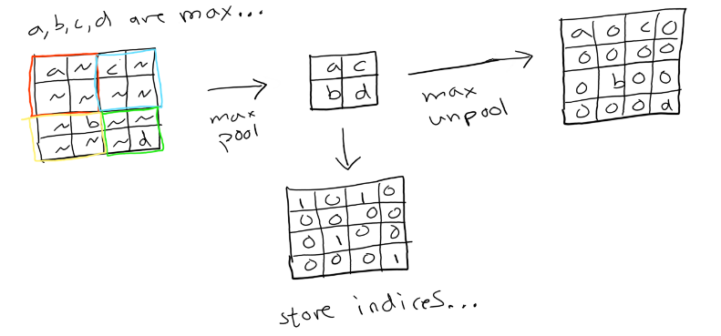
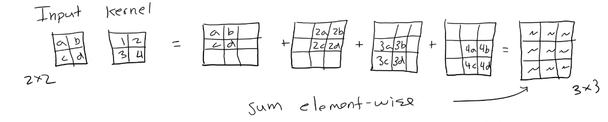
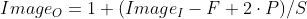
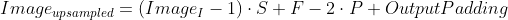
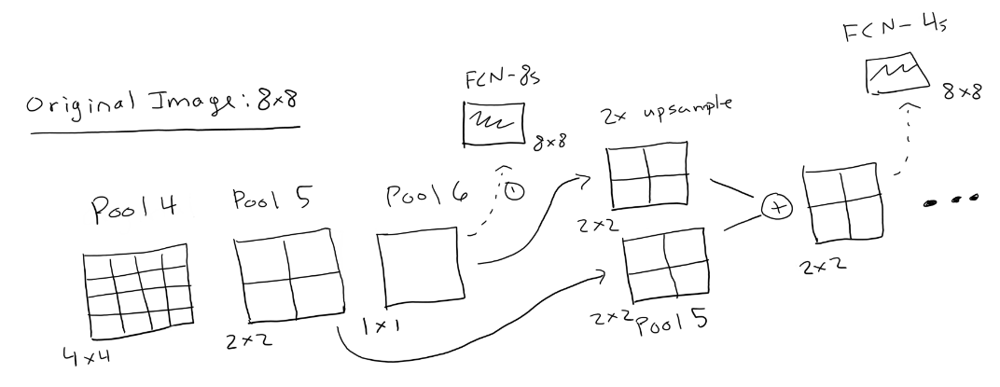
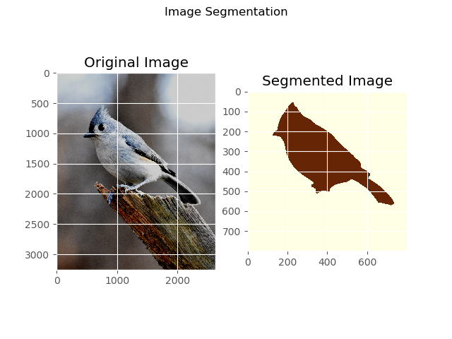
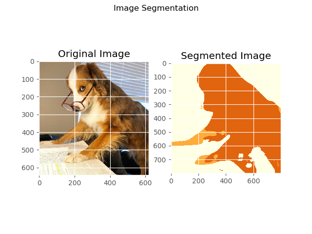

# Semantic Segmentation (FCN)

## Fully Convolutional Networks
In a traditional **Convolutional Neural Network (CNN)**, the aim is to predict the class of the entire input photo. This is done by eventually reducing the number of nuerons within the network to be the same number of classes. Then, a softmax layer converts these logits into a probabilty spectrum, where the argmax of the neurons represents which class is most likely.

However, this differs from a **[Fully Convolutional Network (FCN)]()** as there are no fully connected layers. Instead, you use `1x1` convolution filters to reshape the number of filters (or channels) into the number of classes. Then, for each pixel, you take the argmax across the channel axis to select the most likely class. Doing this over all pixels in your image, you wind up with a segmented image. I followed this [guide](https://towardsdatascience.com/review-fcn-semantic-segmentation-eb8c9b50d2d1) to start.
### Architecture
In general, the goal is to take an input of an image and learn its features with traditional networks (encoder) but then reconstruct the image (decoder) into an output of shape `[N, C, H, W]` where `N` is the batch size, `C` is the number of classes (channels), `H` is height, and `W` is width. An example of a network is below:


#### Encoder
The encoder part of the network is generally called the backbone. Here, you can choose ResNet, SqueezeNet, Inception Module, etc. This part is trained just like usual as its purpose is to learn as much about the input image as possible.

However, as you will see later on, there are some limitations for how deep you can go as you want to be able to retain enough information so that you can reconstruct the image's original content.

#### Decoder
Again, the goal of the decoder is to reconstruct the image in its spatial regions, that is its height and width. Below, we go over some of the techniques you can use to unpool your convolved image.
* Nearest Neighbor / Bilinear Interpolation
* Max Unpooling
* Transposed Convolutions

Upsampling by a **[nearest neighbor](https://www.youtube.com/watch?v=AqscP7rc8_M&ab_channel=Computerphile)** or **[bilinear interpolation](https://www.youtube.com/watch?v=AqscP7rc8_M&ab_channel=Computerphile)** is the simplest method. This does not learn anything new, but rather just "smooths" out or "repeats" the image as it is projected into a larger size.


**Max Unpooling** is a bit smarter as it remembers the indices where the most active neuron was captured. And so, you can place the maximum value back where it was captured and zero out all the other indicies within the max pooling kernel size.

**[Transposed Convolutions](https://blog.paperspace.com/transpose-convolution/)**, however, give one the most flexibility as the kernels used can actually be learned. Thus, you can find *the best upsampling* kernel for a particular image. This commonly yields better results and is the reason why it was picked in the FCN paper.

This is done by essentially multiply the filter with the input image and summing up the different locations into a final upsampled image. An example of a transposed convolution is below.



Now, in order to generalize this so that one can upsample an image of dimension `h x w` to an image of dimension `H x W`, one must know how the output shape changes during convolution. Recall the below formula

<p align="center">
  
</p>

Now, if one were to solve for the input size, we can find a formula such that we can alter the padding and stride so that we upsample our image. Doing so, we have

<p align="center">
  
</p>

Due to the above formula, one can inspect their encoder network and calculate the necessary upsampling parameters in order for the image to return to its original dimension. *Notice: This is independent of the image input size and only on the encoder network parameters*
#### Classifier
Now that you have a network that can learn the high and low level features of the network (encoder), and you have something that can reconstruct it to be the same size of its input size in height and width (decoder), we must make it into a shape that uses the number of classes so that an evaluation of the loss function can happen.

This is done with `1x1` convolution filters. Given an arbitrary number of channels, we can use `1x1` convolution filters to reduce the number of channels to the number of classes. This is done as a new filter is created from convolving across the entire depth. Doing this a number of times gets our new depth.

#### Skip Connections
In theory, this model works perfectly. However, as the paper pointed out, since the network is a convolutional autoencoder, if you upsample from the bottleneck layer (the most compressed), then the reconstruction will be quite coarse as it generally has lost the notion of the original image's geometry, that is its *global* information.

For instance, if our encoder model with its pooling layers were to reduce the spatial dimensionality of our input image to 1/60th of its original size, then to recover that image we must resample it 60 times. Although reducing the image by many convolutions learn many important features, that is *local* information, the deeper you go, the more global information you lose.

However, if one were to use **[skip connections](https://theaisummer.com/skip-connections/)**, and add the previous unpooled layer's geometry to the upsampled one, then the image's geometry would not necessarily be completely lost. This acts as a refinement towards the reconstruction image. So, in general, if you limit the magnitude of your upsampling, then the output will be more defined. This is the reason we see the variants FCN-32, FCN-16, FCN-8, where the number following FCN represents the magnitude of the upsampling.



Above we have a simple example with low dimensionality (notice that this example is not particularly important but becomes very important the more convolved the image is). Moreover, you can generally see where U-Net gets its structure as it uses this technique for its main backbone.

In general we have *short skip connections* that act on the same input dimensions after some type of activation. These are seen in ResNet. However, when we have an encoder-decoder network, we typically experience *long skip connections* as the skip connections are not added before and after an activation layer but rather after some type of decoder operations such as transposed convolutions. The FCN model utilizes long skip connections as it is an encoder-decoder network.

---

### Implementation in PyTorch
For sake of simplicity and time, I used a pretrained FCN with Resnet101 being the backbone. I started to compare these results with my own CNN that was truncated before the FC layers and then trained; however, I ran out of time and so decided to focus on the model theory. Using this pretrained network, it allowed me to use images that aligned with the given classes that the model was trained on ([PASCAL VOC](http://host.robots.ox.ac.uk/pascal/VOC/)).

First we load the pretrained model with torchvision and store the transformations for the input data to use later on our test images.

I followed this [article](https://www.learnopencv.com/pytorch-for-beginners-semantic-segmentation-using-torchvision/).

```python
model = models.segmentation.fcn_resnet101(pretrained=True).eval()

transform_VOC = T.Compose([T.ToTensor(), T.Normalize(mean=[0.485, 0.456, 0.406], std=[0.229, 0.224, 0.225])])
full_dataset = torchvision.datasets.VOCSegmentation("/projects/brfi3983/", image_set='train', download=True, transform=transform_VOC)
test_dataset = torchvision.datasets.VOCSegmentation("/projects/brfi3983/", image_set='val', download=True, transform=transform_VOC)
```

Next, we pass our image into the transformer and add an axis for a single batch
```python
inp = transform_VOC(image).unsqueeze(0)
```
Finally, we can pass this through our network and grab the output. As we only want the actual output, no hooks are necessary. Additionally, this particular pretrained FCN outputs a dictionary, where the output is accessed by the key `out`.

Lastly, recall that the output is in the shape of `[N, C, H, W]` and so if we wish to get the segmented picture, we can take the most active neuron per pixel across its channels. That is, if there are 5 classes, and the corresponding output is `(channel#: probability) = {1: 0.15, 2: 0.1, 3: 0.6, 4: 0.05, 5: 0.1}`, then the model is saying the third channel (class) is the most likely.

```python
# Passing data into model
out = model(inp)['out']
print(f'Output shape: {out.shape}')

# Seeing which classes are most dominant across its depth
segmented_image = torch.argmax(out.squeeze(), dim=0).detach().cpu().numpy()
classes_in_image = np.unique(om)
```
Finally, one can choose to encode the different classes with RGB values, or do what I did, which was to just plot the image as each color is going to signify a different class. Doing so with some test images and comparing them to the original image we have the following graphs.

You will also notice that all of these are a fairly large size; however, you can redefine your transform variable to center crop or resize for a balance of model efficiency or accuracy.

First we have a photo of a bird.


Below, you will notice that the size our the output for a single batch and 21 classes, matches the output size of 800x800. You will also notice that it detected classes 0 (unlabelled) and 3 (bird).

```bash
Output shape: torch.Size([1, 21, 800, 800])
(800, 800)

# Classes detected
[0 3]
```

Next, we have a person jumping up on a rock.


As we fixed the transformation, the output size is the same. However, you will notice that the classes detected are now 0 (unlabelled), 3 (bird), and 15 (person).

```bash
Output shape: torch.Size([1, 21, 800, 800])
(800, 800)

# Classes detected
[ 0  3 15]
```

Lastly, we have a fun yet slightly more challenging picture.


Again, the spatial dimensions are the same. However, here it detects are 0 (unlabelled), 8 (cat), 10 (cow), 12 (dog), and 18 (sofa).
```bash
Output shape: torch.Size([1, 21, 800, 800])
(800, 800)

# Classes detected
[ 0  8 10 12 18]
```