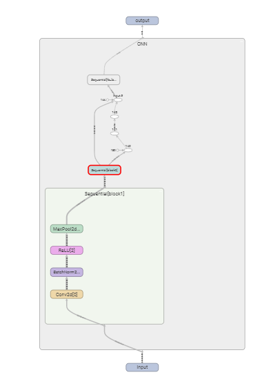

# PyTorch Lightning and SLURM Setup
## Introduction
In this report, I will go over a lightweight wrapper called [Lightning](https://pytorch-lightning.readthedocs.io/en/stable/) for **PyTorch**. This takes out the boilerplate code and adds functionality for scaling as well as flexibility. For instance, in this report, I will go over how you can you separate models, data, and training strategies so that you can experiment with your model. In addition to the many awesome features Lightning Provides, I will also be going over how to also incorporate your code with a SLURM cluster.

### PyTorch Lightning Model
The code for Lightning is the same exact code as PyTorch, except that it is just structured into different functions. This allows the programmer to quick initialize objects of different classes (models, data, etc.) so that he or she can change their system. This yields great flexibility in experimentation. Using Lightning's main site as well as some [blogs](https://towardsdatascience.com/from-pytorch-to-pytorch-lightning-a-gentle-introduction-b371b7caaf09)
#### LightningModule
First we will start with the Lightning module. Below, you will see that the structure of the model is the exact same as PyTorch. We will then add on additional features as we learn more about Lightning.
```python
class CNN(pl.LightningModule):
	def __init__(self, num_classes, learning_rate):
		super().__init__()

		# Defining Accuracy and Model Architecture
		self.block1 = nn.Sequential(
			nn.Conv2d(in_channels=3, out_channels=64, kernel_size=5, stride=1),
			nn.BatchNorm2d(64),
			nn.ReLU(),
			nn.MaxPool2d(kernel_size=2, stride=2))
		self.block2 = nn.Sequential(
			nn.Conv2d(in_channels=64, out_channels=32, kernel_size=5, stride=1),
			nn.BatchNorm2d(32),
			nn.ReLU(),
			nn.MaxPool2d(kernel_size=2, stride=2))
		self.fc_layers = nn.Sequential(
			nn.Linear(32*5*5, 64),
			nn.ReLU(),
			nn.Dropout(p=0.2),
			nn.Linear(64, 32),
			nn.ReLU(),
			nn.Dropout(p=0.2),
			nn.Linear(32, num_classes))

	# Forward Pass
	def forward(self, x):
		x = self.block1(x)
		x = self.block2(x)
		x = x.view(x.size(0), -1)
		x = self.fc_layers(x)

		return x
```
Now, we can implement our training, validation, testing, and optimization. These are all done with specific functions from Lightning. Here we will pass the same arguments in and they will be called each time that loop begins. All of this is done in the same class defined from above
```python
class CNN(pl.LightningModule):
	def __init__(self, num_classes, learning_rate):
		super().__init__()
	...
	# Optimizer - can run multiple optimizers
	def configure_optimizers(self):
		optimizer = optim.Adam(self.parameters(), lr=learning_rate)

		return optimizer

	# Runs during training
	def training_step(self, batch, batch_idx):
		x, y = batch
		outputs = self(x)
		criterion = nn.CrossEntropyLoss()
		loss = criterion(outputs, y)

		return {'loss': loss}

	# Runs during validation
	def validation_step(self, batch, batch_idx):
		x, y = batch
		outputs = self(x)
		criterion = nn.CrossEntropyLoss()
		loss = criterion(outputs, y)

		return {'loss': loss}

	# Runs during testing
	def test_step(self, batch, batch_idx):
		x, y = batch
		outputs = self(x)
		criterion = nn.CrossEntropyLoss()
		loss = criterion(outputs, y)
```
In the above code, you will see that each of these functions are the exact same thing. This makes it very easy for changing code without creating unnecessary bugs or complicated code in your for loops for training. You will notice that each function except from the testing loop return the loss. This is required so that you can either optimize or print out the loss values during training.

Although I have it setup to include a validation and testing loop, these are optional. What is not optional is that if you include a `training_step()` or a `validation_step()`, you must include batches of data in their corresponding `Dataloader`. In short, if you have a validation step, it will expect validation data. Speaking of, where is this data?
#### LightningDataModule
Here, the data module is used to separate the data specific tasks from the model. This lets one change the data from `MNIST` to `CIFAR10` and vice-versa. It also gives you a cleaner approach to transforming data if your validation set requires a different transformation that your training.

In addition to that, you can have different situations where you can easily pass in an argument and train on a certain split of data. Lastly, you can organize it in such a way that the hardware utilizes the function calls most efficiently (covered in a later section).

Nonetheless, we can organize our code in the following manner
```python
class CIFAR10DataModule(pl.LightningDataModule):
	def __init__(self, bs):
		super().__init__()

		# Defined constants and transforms
		self.batch_size = bs
		self.transform = transforms.Compose([transforms.ToTensor(), transforms.Normalize((0.5, 0.5, 0.5), (0.5, 0.5, 0.5))])

	# Downloading the data
	def prepare_data(self):
		self.full_dataset = torchvision.datasets.CIFAR10("/projects/brfi3983/", train=True, download=True, transform=self.transform)
		self.test_dataset = torchvision.datasets.CIFAR10("/projects/brfi3983/", train=False, download=True, transform=self.transform)

	# Splitting our data for our model
	def setup(self, stage=None):
		self.dims = (1, 3, 32, 32)
		self.train_dataset, self.val_dataset = random_split(self.full_dataset, [45000,5000]) # 50,000 "training" images = 45,000 training and 5,000 validation

	# Creating train batches
	def train_dataloader(self):
		return DataLoader(dataset=self.train_dataset, batch_size=self.batch_size, shuffle=True, num_workers=3, pin_memory=True)

	# Creating validation batches
	def val_dataloader(self):
		return DataLoader(dataset=self.val_dataset, batch_size=self.batch_size, shuffle=False, num_workers=3, pin_memory=True)

	# Creating test batches
	def test_dataloader(self):
		return DataLoader(dataset=self.test_dataset, batch_size=self.batch_size, shuffle=False, num_workers=3, pin_memory=True)
```
Picture above, we have a global transformation that applies to all of our datasets. Additionally, you will see that `setup()` splits our data into a validation and training set. Recall that since our model included a `validation_step()`, we had to provide a `val_dataloader()` here.

Apart from the obvious arguments, you will notice the arguments `num_workers` and `pin_memory`. These relate to the hardware and allow us to speed up our computation. In short, it is recommended to have `pin_memory` on if you are on a GPU and to increase the `num_workers` until you do not see an improvement in speed. I have seen various recommendations like setting it equal to *4 x #GPU's* or *# of cpu cores* as well.
#### Training
Now that we have our model and data ready, we need to actually train our network. Luckily, this is where the fun begins as the tedious for loops are out of your way and the experimental flexibility is all open arms. We will begin with a simple example and go over various situations. Now, given our modules defined above, we can run this with the following
```python
# Data Module and Model
dm = CIFAR10DataModule(bs)
model = CNN(num_classes, learning_rate)

# Running our Model
trainer = Trainer(max_epochs=epochs)
trainer.fit(model, dm)
```
Notice that we have a separate object for our datamodule. If, say, we wanted to test our network on the MNIST dataset, we simply change `dm` and pass that into our `.fit()` method.

Next, we have testing. To test, make sure you have the corresponding `test_dataloader()` and `test_step()` and it is the same process with a slight caveat. For this, you simply call the following
```python
# Data Module and Model
dm = CIFAR10DataModule(bs)
model = CNN(num_classes, learning_rate)

# Running our Model
trainer = Trainer(max_epochs=epochs)
trainer.fit(model, dm)

# Testing
result = trainer.test()
```
This will return a tensor with its test loss. However, there are metrics you can use to make predictions and test them, such as a confusion matrix. This is related to the following section, where we will be logging our results.

Lastly, we can use various parameter arguments inside `Trainer` that will make our job more efficient. Just of few of them are
* fast_dev_run -> runs a full cycle with only one batch to make sure the model is setup properly
* profiler -> returns the time taken at each step of your model
* overfit_pct -> allows you to train on a small percentage of your set to test for bugs
* gradient_clip_val -> clips the gradient incase of exploading gradient problems
#### Logging
Although there are many ways to log, the default logger is Tensorboard. Using this, we can implement logging by simply calling the `self.log()` method in our model class. If we want to directly use Tensorboard functionality, we can do a similar call of `self.logger.experiment.()` where we can add scalars, histograms, graphs, etc. I followed this [article](https://www.learnopencv.com/tensorboard-with-pytorch-lightning/) which I highly recommend.

Thanks to Lightning's ease of structure with the training loop, validation loop, etc., we can simply add these functions inside whichever loop to control the frequency of its logging. You can also specify if you would like it per epoch or step with the `self.log()` method. If, for example, we want to calculate the training accuracy per epoch, we can use Lightning's `.metrics` and call it each step. Formally, we have
```python
class CIFAR10DataModule(pl.LightningDataModule):
	def __init__(self, bs):
		super().__init__()
		self.accuracy = pl.metrics.Accuracy() # define the accuracy metric here
	...
	# Runs during training
	def training_step(self, batch, batch_idx):
		x, y = batch
		outputs = self(x)
		criterion = nn.CrossEntropyLoss()
		loss = criterion(outputs, y)
		accuracy = self.accuracy(outputs, y)

		# Logging to tensorboard (for each epoch)
		self.log('Training Loss', loss, on_step=False, on_epoch=True, prog_bar=True, logger=True)
		self.log('Training Accuracy', accuracy, on_step=False, on_epoch=True, prog_bar=True, logger=True)

		return {'loss': loss}

	# Runs during validation
	def validation_step(self, batch, batch_idx):
		x, y = batch
		outputs = self(x)
		criterion = nn.CrossEntropyLoss()
		loss = criterion(outputs, y)
		accuracy = self.accuracy(outputs, y)

		# Logging to tensorboard (for each epoch)
		self.log('Validation Loss', loss, on_step=False, on_epoch=True, prog_bar=False, logger=True)
		self.log('Validation Accuracy', accuracy, on_step=False, on_epoch=True, prog_bar=True, logger=True)

		return {'loss': loss}

	# Runs during testing
	def test_step(self, batch, batch_idx):
		x, y = batch
		outputs = self(x)
		criterion = nn.CrossEntropyLoss()
		loss = criterion(outputs, y)

	def training_epoch_end(self,outputs):

		# Logs computational Graph
		if self.current_epoch == 1:
			sample_img = torch.rand((1, 3, 32, 32), device=self.device)
			self.logger.experiment.add_graph(self, sample_img)

		# Logs weights and biases per each layer
		for name,params in self.named_parameters():
			self.logger.experiment.add_histogram(name, params, self.current_epoch)
```
Visualizing our results for a sample network, we can see we have a computation graph, a histogram of the weights and biases, and all the graphs for validation, training, etc. In the future, I would like to include hyperparamters targeting as that would make the most use of a scientific computing backend.




### Lightning with SLURM
#### Installing CUDA enabled Libraries
To utilize scientific computing with your PyTorch code, Lightning allows you to specify the number of GPU's, nodes, distribution training, and even TPU's. This section builds off of my first report(link), we I showed how you can get your SLURM account started. **_The main difference, apart from incorporating Lightning, is that you must build your software on a GPU node._** This will allow you to utilize the GPU's with SLURM. Otherwise, it will not work.

So to do this, follow the same steps in the first report. However, first get access to a GPU enabled node interactively. To do so, after logging into the login node run the following:
```bash
sinterative --partition=[GPU enabled partition] --time=00:30:00 #allows you to use node for 30 minutes
```
Once the node becomes available and you get access, you can now create a conda environment with the following
```bash
conda -create [virtual env name] python=3.6
```
Then you can activate it and build your CUDA enabled software as well as Lightning
```bash
source curc/sw/anaconda3/latest
conda activate [virtual env name]
conda install pytorch-lightning pytorch
```
#### Lightning SLURM Code
Now you have the software built on a GPU node, and so, can call it through the script onto the same GPU to run the code. However, you need to know how to connect this to Lightning. By default when you run your `Trainer`, it will run on the CPU. However, if you specify the number of GPU's it will change. For instance,
```python
Trainer(max_epochs=epochs) # cpu
Trainer(max_epochs=epochs, gpus=1) # 1 gpu
Trainer(max_epochs=epochs, gpus=4) # 4 gpus
Trainer(max_epochs=epochs, gpus=-1) # all available gpus
```
Now, say you want to run your code on multiple nodes. Then, you can also specify the number of nodes as an argument in `Trainer`
```python
Trainer(max_epochs=epochs, num_nodes=1) # cpu on single node
Trainer(max_epochs=epochs, num_nodes=2, gpus=4) # 4 gpus across 2 nodes (8 gpus total)
```
Additionally, you can control the distributed training type. For instance, if you want to run your code on multiple GPU's but a single node, you can choose `DataParallel`. However, if you want to run it across multiple nodes, you can instead choose `DistributedDataParallel`. An interesting note is that even if you are running on a single node, it is [recommended](https://pytorch.org/tutorials/intermediate/ddp_tutorial.html#:~:text=Comparison%20between%20DataParallel%20and%20DistributedDataParallel&text=First%2C%20DataParallel%20is%20single%2Dprocess,%2D%20and%20multi%2D%20machine%20training.) to run `DistributedDataParallel` due to *"GIL contention across threads, per-iteration replicated model, and additional overhead introduced by scattering inputs and gathering outputs."* Altogether, this looks like
```python
Trainer(max_epochs=epochs, num_nodes=1, distributed_backend='dp') # cpu on single node
Trainer(max_epochs=epochs, num_nodes=3, distributed_backend='dpp', gpus=1) # 1 gpu across 3 nodes with dpp backend
```
Moreover, if you are attempting to train a large model and have memory issues, Lightning supports 16-bit precision. This is as simple as downloading NVIDIA's `apex` package and then passing in `amp_level='02', precision=16)` into `Trainer`. Here, we selected 16-bit precision and the `amp_level='02'` is for fast mixed precision training. What it does is keep your weights at 32 bit but changes your data to 16 bits `amp_level='00'` is for full precision.

Lastly, recall that we created a data and model module separately. We can utilize the functions in the data module for efficiently. For instance, the `setup()` function is called on every GPU while the `prepare_data()` is called on only one GPU. This way, you can do one time operations on `prepare_data()` to save time. This counters the fact that if you are doing distributed training, instead of downloading the data a number of times, it only does it once. All of this is done automatically.

### Future Goals
In the future, I plan to do more exploratory work using the experimental tools I created in this article. Namely, I am currently looking into the surface of the loss function and the affect of depth, width, hyperparameters, and activation functions. Speaking of, I aim to implement hyperparameter logging in PyTorch Lightning as well, which would immensely help. I also hope to extend this relation to adversarial networks to understand when the structure of data is a factor; moreover, when the network *and* the data are factors.

This I believe will be able to dictate when adding depth, width, or other architecture features such as skip connections. If it can be generalized across multiple models and different types of data, that would be ideal. Obviously, I am still looking into papers, but I have started reading a couple and look forward to what I can do in the future.